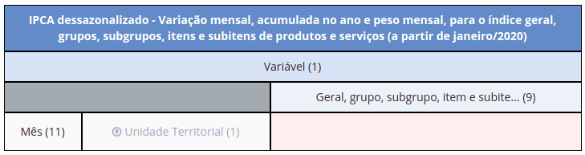

<style type="text/css">
body{
  font-size: 14pt;
  text-align: justify;
}
td{font-size: 16px;}
code.r{font-size: 14px;}
pre{font-size: 12px;}
</style>
```{r, include=FALSE}
knitr::opts_chunk$set(message = FALSE)
options(scipen = 999)
```
Para quem ainda não lida com dados do IBGE de maneira sistemática, dificuldades com o SIDRA não são algo incomum. A tentativa de importar as planilhas sob um formato amigável para trabalhos analíticos (e futuras estimações) pode trazer dor de cabeça.

Este blog estreia com a primeira parte de uma sequência de postagens que tentará atenuar essas dificuldades. Na postagem de hoje, utiliza-se a variação mensal do IPCA desagregado em grupos para visualizar a inflação brasileira em tempos de Covid.

## Pacotes

```{r}
library(sidrar)    # importação via API
library(ggthemes)  # estética do gráfico
#
library(dplyr)
library(purrr)
library(forcats)
library(ggplot2)
```
<br/>
  
## Dados

Não será preciso baixar nenhum arquivo. Seguindo os passos abaixo, encontra-se a expressão que permitirá levar os dados direto para o **R**:
  
* Acessar o portal do [SIDRA](https://sidra.ibge.gov.br/)
* IPCA > Relação de Tabelas > 7061
* Definir opções:
  - Variável: **variação mensal** (%)
  - Geral, grupo, subgrupo, item e subitem: **9 componentes**
  - Mês: **mar/2020** a **jan/2021**
  - Unidade Territorial: **Brasil**
* Arrastar os blocos até ficarem dispostos assim:
  
{}
  
* Menu Inferior Direito: Links de Compartilhar > Parâmetros para a API
  
<br/>
Feito. Cria-se então um objeto com a expressão (a partir de `"/t"`):

```{r}
t7061 <- "/t/7061/n1/all/v/306/p/last%2011/c315/7170,7445,7486,7558,7625,7660,7712,7766,7786/d/v306%202"
```
  
<br/>
E esse objeto é suficiente para importar os dados por meio do providencial `{sidrar}`:

```{r}
df_ibge <- sidrar::get_sidra(api = t7061)

names(df_ibge)
```
<br/>
  
## Manipulação

Das treze colunas, apenas três serão necessárias aqui:

```{r}
ipca <- df_ibge %>%
  as_tibble() %>%
  select(
    date = "Mês",
    component = "Geral, grupo, subgrupo, item e subitem",
    mth_inflation = "Valor"
  )

head(ipca, 9)
```

Os dados vêm num padrão "comprido" ao invés de "largo": não há uma coluna para cada componente, e isso faz com que se tenha nove observações para cada mês. Diante da finalidade desta postagem, o ideal será mantê-los assim.
  
<br/>
O cálculo da inflação acumulada para $t \in \{1,\ ..., 11\}$ meses de pandemia é recursivo (depende dos próprios valores defasados). De uma variação mensal inicial $\pi_1 = \pi_1^{ac}$, tem-se

$$\pi_t^{ac} = (1\ +\ \frac{\pi_t}{100})\ \times\ \pi_{t-1}^{ac}\ +\ \pi_t\ $$

para $t\neq1$. Essa atribuição requer a função `purrr::accumulate()` para ser realizada dentro do flow --- em parceria com `dplyr::group_by()` para ser aplicada a cada componente em separado:

```{r}
ipca <- ipca %>%
  group_by(component) %>%         # agrupamento
  mutate(
    # .y
    accum_inflation = accumulate(
      mth_inflation,              # .x
      ~ (1 + .x / 100) * .y + .x  # atribuição recursiva de .y
    )
  )
```
  
<br/>
Conferindo o primeiro e [mais relevante](https://www.ipea.gov.br/cartadeconjuntura/index.php/tag/inflacao-de-alimentos/) componente do período:

```{r}
head(arrange(ipca, component), 11)
```
  
<br/>
Agora, chega-se ao valor acumulado no final do período para todos os componentes:

```{r}
ipca <- ipca %>%
  summarize(
    accum_inflation = last(accum_inflation),  # jan/2021
    .groups = "drop"                          # desagrupamento
  )
```
  
<br/>
E eis a matéria-prima do gráfico:

```{r}
arrange(ipca, desc(accum_inflation))
```

Nota: Ao olhar para a deflação dos serviços educacionais, deve-se ter em conta que fevereiro, um mês [particularmente importante](https://valorinveste.globo.com/mercados/brasil-e-politica/noticia/2021/02/09/inflacao-de-fevereiro-deve-ter-impacto-adicional-de-educacao.ghtml) para o componente, é o único que não se faz presente nos dados.
<br/><br/>
  
## Visualização

O primeiro passo para o sucesso do gráfico de barras será, seguindo o embalo da formatação, reordenar a sequência de componentes com `forcats::fct_reorder()` de acordo com o tamanho da inflação acumulada:

```{r}
ipca <- ipca %>%
  mutate(
    component = component %>%
      substring(3) %>%                                    # retirada de numeração
      recode("Alimentação e bebidas" = "Alimentação",
             "Artigos de residência" = "Residência",
             "Saúde e cuidados pessoais" = "Saúde",
             "Despesas pessoais" = "Desp. Pessoais") %>%  # concisão
      fct_reorder(accum_inflation)                        # critério de ordenação
  )
```
  
<br/>
A carcaça do gráfico já pode ser criada:

```{r}
ipca %>%
  ggplot(aes(accum_inflation, component)) +
  geom_col()
```

Porém ela é pouco apelativa (apesar de ter seu charme). O segundo passo será desfrutar das possibilidades de montagem em cima dessa carcaça --- por exemplo, a função `ggplot2::geom_label()`. Esmiuçá-las exigiria uma postagem à parte.

Por último, escolhe-se tema e paleta de cores a gosto. Como a inspiração para esta postagem veio justamente de [matérias jornalísticas](https://www1.folha.uol.com.br/mercado/2020/11/alta-no-preco-de-alimentos-faz-governo-elevar-projecao-de-inflacao-para-2020-e-2021.shtml) sobre a trajetória recente da inflação de alimentos, foi escolhido um padrão do [Wall Street Journal](https://www.wsj.com/) encontrado no `{ggthemes}`:

```{r, echo=FALSE, preview=TRUE}
readRDS("plot-sidra-1.rds")
```
Um senhor ganho de apelo estético.

Na segunda parte da sequência, será possível trabalhar com planilhas mais complexas do SIDRA.
<br/>
  
<span style='color: darkred'>###</span></br>