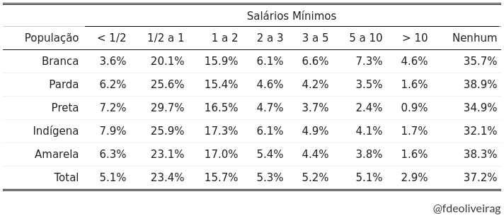
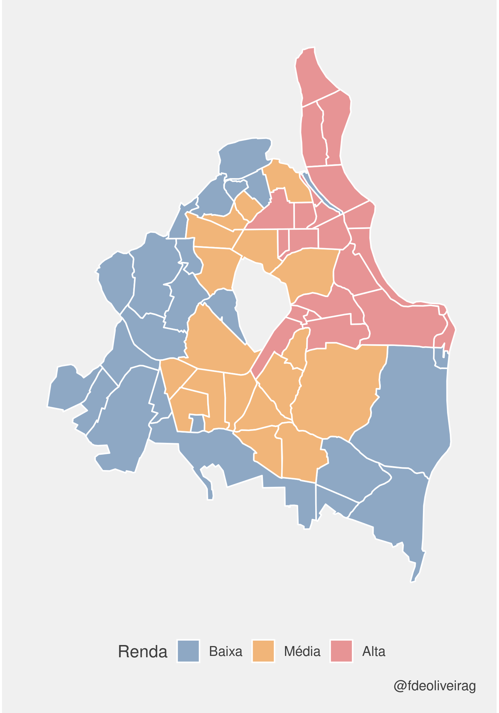

<style type="text/css">
body{
  font-size: 14pt;
}
h1, h2, h3 {
  text-align: left;
}
td{font-size: 16px;}
code.r{font-size: 14px;}
pre{font-size: 12px;}
</style>
Esta postagem representa um esforço preliminar no sentido de testar a possibilidade de prever o nível de renda de um bairro brasileiro apenas com base em sua configuração racial.

O caso analisado será a cidade de origem do autor: a antiga João Pessoa, que conta com 63 bairros registrados no IBGE até então. O algoritmo, todavia, é generalizável para qualquer cidade. Seu instrumental é dividido em duas partes:
  
* Na primeira (não supervisionada), uma [clusterização k-means](https://rss.onlinelibrary.wiley.com/doi/abs/10.2307/2346830) agrupa os bairros em três classes relativas de renda: alta, média e baixa;
* Na segunda (supervisionada), uma [classificação logística não-binária](https://www.jstor.org/stable/2984952) prevê a qual cluster o bairro pertence dada sua proporção de indivíduos brancos.

## Pacotes
```{r, message=FALSE}
library(geobr)      # mapa de bairros
library(janitor)    # limpeza de nomes
library(MASS)       # logit ordenado
#
library(tidyverse)
```
<br/>
  
## Dados

A matéria-prima da análise é a [Tabela 3177](https://sidra.ibge.gov.br/pesquisa/censo-demografico/demografico-2010/universo-caracteristicas-da-populacao-e-dos-domicilios) do Censo Demográfico 2010. 

Após sua importação, um trabalho razoável de limpeza --- valores ausentes, concisão, renivelamento e reordenação de categorias --- resulta num data frame que apresenta as diferentes combinações para os 63 bairros entre 5 grupos raciais e 8 grupos de renda. É possível baixá-lo [neste repositório](https://github.com/fdeoliveirag/datasets).

```{r}
df_pop <- read_rds("censo_3177_pb.rds")

# ex. bairro mais populoso da cidade, população parda
filter(df_pop, bairro == "Mangabeira", racial == "Parda")
```

```{r, echo=FALSE}
sf_bairros <- read_rds("coordenadas.rds") %>%
  filter(code_muni == 2507507) %>%
  select(name_neighborhood, geom)

theme_set(ggthemes::theme_fivethirtyeight())
```

E para garantir uma visualização espacial dos dados, os polígonos dos bairros podem ser importados através do excelente `{geobr}`:

```{r, eval=FALSE}
sf_bairros <- geobr::read_neighborhood(year = 2010) %>%
  filter(code_muni == 2507507) %>%  # código de João Pessoa
  select(name_neighborhood, geom)
```
<br/>
  
## Contexto

Um panorama das combinações raça-renda para o agregado dos bairros é bastante elucidativo e, dado o escopo do blog, suficiente como justificativa:

```{r, eval=FALSE}
df_pop %>%
  # para cada combinação entre raça e estrato de renda...
  group_by(racial, renda) %>%
  # ...o agregado de todos os bairros; e para cada grupo racial...
  summarize(valor = sum(valor), .groups = "drop_last") %>%
  # ...a proporção de cada estrato;
  mutate(valor = valor / last(valor)) %>%
  # formato largo (estratos de renda em colunas)
  pivot_wider(names_from = renda, values_from = valor)
```

### Rendimento mensal por grupo racial em João Pessoa (2010)
{width=90%}
```{r, echo=FALSE, eval=FALSE}
df_pop %>%
  group_by(racial, renda) %>%
  summarize(valor = sum(valor), .groups = "drop_last") %>%
  mutate(valor = valor / last(valor)) %>%
  ungroup() %>%
  pivot_wider(names_from = renda, values_from = valor) %>%
  mutate_if(is.numeric, ~ scales::percent(.x, accuracy = .1)) %>%
  select(-Total) %>%
  kableExtra::kbl(align = "r",
                  col.names = c("População", "< 1/2", "1/2 a 1",
                                "1 a 2", "2 a 3", "3 a 5",
                                "5 a 10", "> 10", "Nenhum"),
                  position = "left") %>%
  kableExtra::kable_classic_2() %>%
  kableExtra::add_header_above(c(" " = 1, "Salários Mínimos" = 8))
```
<br/>
  
As frações da população branca ganhando de dois salários mínimos em diante são sempre --- e gradativamente --- maiores que as respectivas frações dos outros grupos raciais. Estas, por sua vez, somente decrescem na medida em que a renda aumenta.
<br/><br/>
  
## get_split()

Uma boa tática para lidar com as variáveis é cindir os dados para elas terem suas bases próprias, manipulá-las separadamente e depois reuni-las.

Evitando repetição desnecessária, é possível construir com [tidy evaluation](https://tidyeval.tidyverse.org/dplyr.html) uma função usando `dplyr::enquo()` para chamar as colunas dentro do pipe:

```{r}
get_split <- function(y, x) {
  # variável
  x <- enquo(x)
  # data frame
  y %>%
    # indivíduos por bairro pertencendo a cada categoria da variável
    group_by(bairro, !!x) %>%
    summarize(valor = sum(valor), .groups = "drop") %>%
    # categorias formando colunas
    pivot_wider(names_from = !!x, values_from = valor) %>%
    # limpando os nomes das colunas
    janitor::clean_names()
}
```
<br/>
  
## Proporção de brancos

Com os dados raciais, precisa-se da medida quantitativa de branquitude dos bairros:

```{r}
branq <- df_pop %>%
  get_split(racial) %>%
  summarize(
    bairro,
    prop_branq = branca / total
  )

glimpse(branq)
```

```{r, eval=FALSE}
# branquitude
branq %>%
  ggplot(aes(x = prop_branq)) +
  geom_histogram(aes(y = ..density..)) +
  geom_density()
```

### Distribuição racial dos bairros de João Pessoa (2010)
```{r, echo=FALSE}
n_bw <- branq %>%
  summarize(nclass.FD(prop_branq),
            nclass.scott(prop_branq),
            nclass.Sturges(prop_branq)) %>%
  max()

bw <- branq %>%
  summarize(pretty(range(prop_branq), n = n_bw)) %>%
  pull() %>%
  diff() %>%
  mean()

branq %>%
  ggplot(aes(x = prop_branq)) +
  geom_histogram(aes(y = ..density..),
                 binwidth = bw,
                 fill = "darkolivegreen",
                 color = "white",
                 alpha = .9) +
  geom_density(fill = "darkolivegreen",
               color = "white",
               alpha = .4) +
  scale_x_continuous(labels = scales::percent_format(accuracy = 1)) +
  labs(x = "Proporção de brancos", y = "Densidade Kernel") +
  theme(axis.title = element_text()) +
  labs(caption = "@fdeoliveirag")
```
<br/>
  
## Clusters de renda

No caso dos dados de renda, tem-se como medida a participação de cada estrato na população ocupada dos bairros:

```{r}
rendim <- df_pop %>%
  get_split(renda) %>%
  mutate(
    across(where(is.numeric),
           ~ .x / (total - sem_rendimento))
  ) %>%
  select(bairro, contains("_sm"))

glimpse(rendim)
```

Seja por silhueta ou cotovelo, o número ótimo de clusters varia entre dois e três. Para trabalhar com a ideia de classe média, optou-se pelo último:

```{r}
set.seed(321)  # ordem dos clusters preservada

k_rendim <- rendim %>%
  summarize(
    bairro,
    cluster = select(., -bairro) %>%
      kmeans(centers = 3, nstart = 10,
             algorithm = "Hartigan-Wong") %>%
      pluck("cluster") %>%
      as_factor()
  )

glimpse(k_rendim)
```

```{r, eval=FALSE}
# geografia
k_rendim %>%
  mutate(bairro = str_to_title(bairro)) %>%
  inner_join(sf_ibge, by = c("bairro" = "name_neighborhood")) %>%
  ggplot(aes(geometry = geom, fill = cluster)) +
  geom_sf()
```
### Clusters dos bairros de João Pessoa por renda (2010)
{width=70%}

Nota: O "buraco" no meio do mapa, na verdade, são mais de 500 hectares remanescentes de Mata Atlântica natural, que abrigam o [Jardim Botânico](https://turismo.joaopessoa.pb.gov.br/o-que-fazer/pontos-turisticos/pracas-e-parques/jardim-botanico-benjamim-maranhao/) da cidade.

```{r, echo=FALSE, eval=FALSE}
k_rendim %>%
  mutate(bairro = str_to_title(bairro)) %>%
  inner_join(sf_ibge, by = c("bairro" = "name_neighborhood")) %>%
  ggplot(aes(geometry = geom, fill = cluster)) +
  geom_sf(alpha = .6, color = "white") +
  ggthemes::scale_fill_tableau(
    name = "Renda", labels = c("Baixa", "Média", "Alta")
  ) +
  theme(axis.text = element_blank(),
        panel.grid.major = element_blank()) +
  labs(caption = "@fdeoliveirag") +
  ggsave("plot_rendim.png")
```
<br/>
  
## Classificação

Estimando por logit ordenado:

```{r}
pred_logit <- k_rendim %>%
  inner_join(branq, by = "bairro") %>%
  mutate(
    pred = (cluster ~ prop_branq) %>%
      MASS::polr(method = "logistic") %>%
      predict(),
    acc = (cluster == pred)
  )

glimpse(pred_logit)
```

Na prática, o que acontece com esse modelo bivariado é simplesmente uma otimização da escolha de três intervalos de branquitude para o encaixe de cada cluster:

```{r}
# intervalos
pred_logit %>%
  filter(acc == TRUE) %>%
  group_by(cluster) %>%
  summarize(
    min_prop_branq = min(prop_branq),
    max_prop_branq = max(prop_branq),
    .groups = "drop"
  )
```

Porém, a dimensão racial da estrutura socioeconômica da cidade é tão forte que mesmo essa simplicidade é capaz de prever corretamente o nível de renda de 51 dos 63 bairros:

```{r}
# acurácia por grupos
pred_logit %>%
  group_by(cluster) %>%
  summarize(
    true = sum(acc == TRUE),
    false = n() - true,
    performance = true / n(),
    .groups = "drop"
  )

# acurácia total
summarize(pred_logit, performance = sum(acc == TRUE) / n())
```

Logo, ao separar os bairros de João Pessoa em três faixas de branquitude: i) de 28 a 38%; ii) de 39 a 50% e; iii) de 51 a 70% de brancos, torna-se possível classificar corretamente mais de 4/5 deles entre baixa, média e alta renda.

```{r, eval=FALSE}
# visualização final
pred_logit %>%
  ggplot(aes(x = prop_branq, y = cluster)) +
  geom_boxplot(aes(fill = cluster)) +
  geom_jitter(aes(color = acc))
```

### Bairros de João Pessoa: Raça vs. Renda (2010)
```{r, echo=FALSE, preview=TRUE}
pred_logit %>%
  ggplot(aes(x = prop_branq, y = cluster)) +
  geom_boxplot(aes(fill = cluster)) +
  geom_jitter(aes(color = acc), height = .3) +
  scale_x_continuous(
    name = "Proporção de brancos",
    labels = scales::percent_format(accuracy = 1)
  ) +
  scale_y_discrete(
    name = "Renda",
    labels = c("Baixa", "Média", "Alta")
  ) +
  ggthemes::scale_fill_tableau(
    name = NULL,
    labels = NULL,
    guide = NULL
  ) +
  scale_color_manual(
    name = "Classificação",
    labels = c("Não Prevista", "Prevista"),
    values = c("darkolivegreen", "black")
  ) +
  theme(
    legend.position = "top",
    axis.title = element_text()
  ) +
  labs(caption = "@fdeoliveirag")
```

```{r, echo=FALSE, eval=FALSE}
# ==================================================
library(purrr)

# ==================================================
tot_withinss <- map_dbl(
  1:5,
  function(k) {
    model <- kmeans(x = rendim[, -1], centers = k)
    model$tot.withinss
  }
)

elbow_df <- tibble(k = 1:5, tot_withinss = tot_withinss)

ggplot(elbow_df, aes(k, tot_withinss)) + geom_line() + geom_point()
# ==================================================

# ==================================================
sil_width <- map_dbl(
  2:5,
  function(k) {
    model <- cluster::pam(x = rendim[, -1], k = k)
    model$silinfo$avg.width
  }
)

sil_df <- tibble(k = 2:5, sil_width = sil_width)

ggplot(sil_df, aes(k, sil_width)) + geom_line() + geom_point()
# ==================================================

# ==================================================
modelos <- MASS::polr %>%
  formals() %>%
  .$method %>%
  as.character() %>%
  .[-1]

k_rendim %>%
  mutate(
    map_df(
      set_names(modelos, paste0("pred_", modelos)),
      ~ predict(MASS::polr(cluster ~ prop_branq, method = .x))
    )
  ) %>%
  summarize_at(
    vars(contains("pred_")),
    ~ nrow(filter(k_rendim, cluster == .x))
  ) %>%
  mutate_all(
    ~ scales::percent(`/`(.x, nrow(k_rendim)))
  ) %>%
  set_names(str_remove(names(.), "pred_"))
# ==================================================
```
<br/>
  
<span style='color: darkred'>###</span></br>