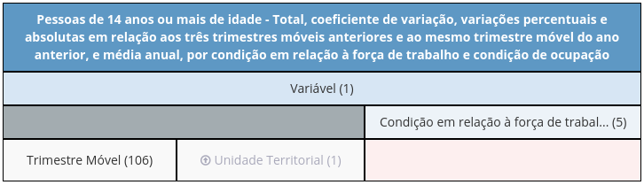

<style type="text/css">
body{
  font-size: 14pt;
}
h1, h2, h3 {
  text-align: left;
}
td{font-size: 16px;}
code.r{font-size: 14px;}
pre{font-size: 12px;}
</style>
Aproveitando a derradeira divulgação dos dados da PNAD Contínua, esta postagem se dedica à visualização de indicadores centrais para a análise do mercado de trabalho brasileiro.

Em particular, compara-se o desempenho atual com o período recessivo entre 2014 e 2016, tornando explícito o caráter sui generis da crise atual.

# Pacotes
```{r, message=FALSE}
library(sidrar)     # importação via API
library(ggseas)     # gráfico sem sazonalidade
library(ggthemes)   # estética do gráfico
#
library(tidyverse)
```

```{r, include=FALSE}
options(scipen = 999)
options(dplyr.summarize.inform = FALSE)

p_margin1 <- margin(t = .5, b = .25, unit = "cm")
p_margin2 <- margin(t = 0,  b = .4,  unit = "cm")
p_margin3 <- margin(t = .4, b = 0,   unit = "cm")
```
<br/>

# Dados

O procedimento de importação dos dados será o mesmo da [primeira postagem da série](https://tidyeconomics.netlify.app/posts/2021-02-22-explorando-o-sidra-com-tidyverse-parte-i/), porém aplicado à Tabela 6318 da PNADC/M.

Escolhendo apenas a quantidade total de pessoas (em milhares) como variável, para todas as condições e trimestres móveis, a disposição dos blocos fica assim:

{}

Então, obtém-se sua consequente expressão:

```{r}
t6318 <- "/t/6318/n1/all/v/1641/p/all/c629/all"
```
  
<br/>
E a partir dela os dados originais, diretamente da fonte para o R:

```{r, eval=FALSE}
df_ibge <- sidrar::get_sidra(api = t6318)

names(df_ibge)
```

```{r, echo=FALSE}
df_ibge <- read_rds("ibge_6318.rds")

names(df_ibge)
```
<br/>
  
# Manipulação

Bem como na Parte I, aqui também são necessárias apenas três colunas:

```{r}
pnad <- df_ibge %>%
  as_tibble() %>%
  select(
    date  = "Trimestre Móvel (Código)",
    name  = "Condição em relação à força de trabalho e condição de ocupação",
    value = "Valor"
  )

head(pnad, 5)
```

Porém, o ideal para esta postagem é modificar o padrão dos dados de "comprido" para "largo" com `tidyr::pivot_wider()`, fazendo com que cada categoria possua sua própria coluna (e cada data torne-se única):
<br/>
  
```{r}
pnad <- pnad %>%
  pivot_wider(names_from = name, values_from = value) %>%
  rename_with(~ c("pia", "pea", "ocup", "desocup", "pnea"), -date)

tail(pnad)
```
  
<br/>
Finalmente, chega-se ao que interessa para os gráficos:
  
--- Os trimestres móveis transformados em objeto de tempo com `readr::parse_date()`;<br/>
--- A população ocupada em milhões;<br/>
--- As taxas de desemprego e de participação na força de trabalho.

```{r}
pnad <- pnad %>%
  transmute(
    date   = parse_date(date, format = "%Y%m"),
    ocup   = ocup / 1000,
    desemp = desocup / pea * 100,
    partic = pea / pia * 100
  )

glimpse(pnad)
```
<br/>
  
# Visualização

Optando por um tema inspirado na [The Economist](https://www.economist.com/) para todos os gráficos:

```{r}
theme_set(ggthemes::theme_economist())
```

No primeiro gráfico, tem-se a população ocupada de janeiro de 2019 a janeiro de 2021. Para ressaltar valores importantes, criou-se uma nova variável apenas com primeira, última, mínima e máxima do período. Além disso, detalhou-se melhor a escala de tempo:

```{r, eval=FALSE}
pnad %>%
  filter(date >= "2019-01-01") %>%
  mutate(
    txt = if_else(
      ocup %in% c(first(ocup), last(ocup), min(ocup), max(ocup)),
      ocup, NULL
    )
  ) %>%
  ggplot(aes(x = date, y = ocup, label = txt)) +
  geom_line() +
  geom_text() +
  scale_x_date(date_labels = "%b %Y")
```

```{r, fig.height=4.5, echo=FALSE}
pnad %>%
  filter(date >= "2019-01-01") %>%
  mutate(
    txt = if_else(
      ocup %in% c(first(ocup), min(ocup), last(ocup), max(ocup)),
      str_replace(round(ocup, 1), "\\.", "\\,"), ""
    )
  ) %>%
  ggplot(aes(x = date, y = ocup, label = txt)) +
  geom_line(size = 1.2, color = "darkolivegreen") +
  geom_text(family = "ITC Officina Sans", vjust = -1.5, fontface = "bold") +
  labs(x       = NULL,
       y       = NULL,
       caption = "Fonte: @fdeoliveirag via PNAD Contínua.",
       title   = "População Ocupada (milhões de pessoas)") +
  scale_x_date(date_labels = "%b %Y") +
  scale_y_continuous(limits = c(80, 100)) +
  theme(
    plot.title   = element_text(margin = margin(b = .5, unit = "cm")),
    axis.text.x  = element_text(vjust = .5),
    plot.caption = element_text(margin = p_margin1),
    text         = element_text(family = "ITC Officina Sans")
  )
```

Uma realidade que dá sentido ao segundo gráfico. Nele, procurou-se mostrar --- com `ggplot2::annotate()` --- a diferença entre a crise atual e o último período recessivo, que compreende dez trimestres (2014.Q3 a 2016.Q4) de acordo com o [CODACE](https://portalibre.fgv.br/codace).

A tática mais usada em R para plotar múltiplas séries sob um mesmo período é a combinação entre `tidyr::pivot_longer()` e `ggplot2::facet_wrap()`, resgatando o padrão "comprido" para as variáveis de interesse (no caso, as taxas).

Finalmente, o pacote `{ggseas}` permitiu dessazonalizar as séries "on the fly" para plotagem. O método X-13 foi usado.

```{r, eval=FALSE, echo=TRUE}
# início e fim dos períodos recessivos
codace <- as.Date(c("2014-07-01", "2016-12-01", "2020-01-01"))

pnad %>%
  pivot_longer(c(desemp, partic)) %>%
  ggplot(aes(x = date, y = value, color = name)) +
  ggseas::stat_seas(geom = "line", frequency = 12, start = c(2012, 3)) +
  annotate("rect",
           xmin  = codace[c(1, 3)], xmax  = c(codace[2], Inf),
           ymin  = c(-Inf, -Inf),   ymax  = c(Inf, Inf),
           alpha = .3) +
  facet_wrap(~ name, ncol = 1, scales = "free")
```

```{r, eval=FALSE, echo=FALSE}
# início e fim dos períodos recessivos
codace <- as.Date(c("2014-07-01", "2016-12-01", "2020-01-01"))

pnad %>%
  # criando variáveis <name> e <value> com as taxas
  pivot_longer(c(desemp, partic)) %>%
  # estrutura do gráfico
  ggplot(aes(x = date, y = value, color = name)) +
  # X-13
  ggseas::stat_seas(geom = "line", frequency = 12, start = c(2012, 3)) +
  # fundo cinza em períodos de recessão
  annotate("rect",
           xmin  = codace[c(1, 3)], xmax  = c(codace[2], Inf),
           ymin  = c(-Inf, -Inf),   ymax  = c(Inf, Inf),
           alpha = .3) +
  # para cada série, um plot
  facet_wrap(~ name, ncol = 1, scales = "free")
```

```{r, fig.height=7.5, echo=FALSE}
# início e fim dos períodos recessivos
codace <- as.Date(c("2014-07-01", "2016-12-01", "2020-01-01"))

# título de cada série
labs_facet <- c(desemp = "Taxa de Desemprego",
                partic = "Taxa de Participação na Força de Trabalho")

pnad %>%
  pivot_longer(c(desemp, partic)) %>%
  ggplot(aes(x = date, y = value, color = name)) +
  ggseas::stat_seas(size = .8, frequency = 12, start = c(2012, 3)) +
  annotate("rect",
           xmin  = codace[c(1, 3)], xmax  = c(codace[2], Inf),
           ymin  = c(-Inf, -Inf),   ymax  = c(Inf, Inf),
           alpha = .3) +
  facet_wrap(~ name,
             ncol     = 1,
             scales   = "free",
             labeller = as_labeller(labs_facet)) +
  labs(x       = NULL,
       y       = NULL,
       caption = "Fonte: @fdeoliveirag via PNAD Contínua.") +
  scale_y_continuous(labels = function(x) paste0(x, "%"),
                     limits = c()) +
  scale_color_economist() +
  theme(strip.text      = element_text(margin = p_margin2,
                                       size   = 15,
                                       face   = "bold",
                                       hjust  = 0),
        plot.caption    = element_text(margin = p_margin3),
        legend.position = "none",
        text            = element_text(family = "ITC Officina Sans"),
        panel.spacing   = unit(2, "lines"))
```

```{r, eval=FALSE, echo=FALSE}
pnad %>%
  filter(date %in% c(codace, last(date))) %>%
  summarize(rec1a = desemp[2] - desemp[1],
            rec1b = partic[2] - partic[1],
            rec2a = desemp[4] - desemp[3],
            rec2b = partic[4] - partic[3])

pnad$date[min(pnad$partic)]

last(pnad$partic)
```

A oferta de trabalho, que se manteve praticamente inalterada em 2014-16, sofreu um baque de 5 pontos percentuais durante a pandemia (sendo 7 até agosto e 2 recuperados posteriormente).

Sem essa quebra na série, o desemprego estaria num patamar consideravelmente maior (mesmo partindo de uma taxa já elevada, de 11,2% em janeiro de 2020).

<span style='color: #183139'>###</span></br>
